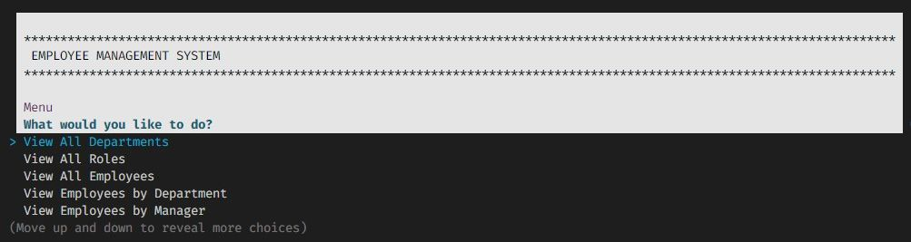
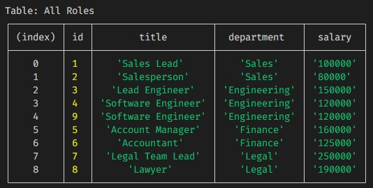
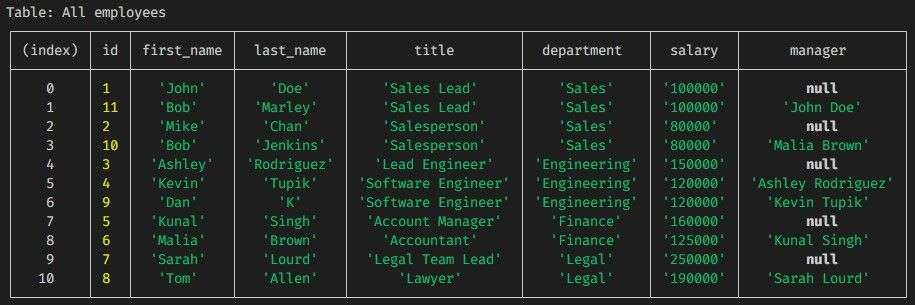
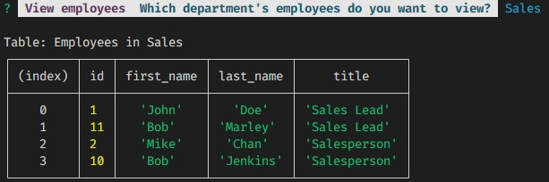
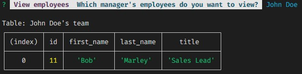
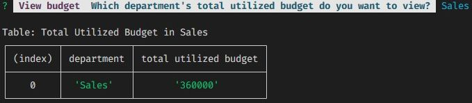

# Employee Management System

  

## Introduction

This easy-to-use employee management system allows the user to perform CRUD actions like view, add, update and delete. It would allow a business manager to add and save business data in order to better arrange and document CRUD.

This CLI application uses npm packages `inquirer`, `SQL` and `chalk`.

I made this app in order to learn how to use SQL queries.

I used GitHub Projects and various Pull Requests to create this app: https://github.com/leoelicos/bcs-12-employee-management-system/projects/1

## Installation

Source code: [Employee Management System on GitHub](https://github.com/leoelicos/bcs-12-employee-management-system).

| Step                          | Instruction                                                                    |
| ----------------------------- | ------------------------------------------------------------------------------ |
| install node                  | https://nodejs.org/en/download/                                                |
| install mysql                 | https://dev.mysql.com/downloads/installer/                                     |
| clone this repo               | `git clone https://github.com/leoelicos/bcs-12-employee-management-system.git` |
| Go inside the database folder | `cd db`                                                                        |
| invoke mysql                  | `mysql -u root -p`                                                             |
| Enter your mysql password     | `{password}`                                                                   |
| Create schema                 | `source schema.sql`                                                            |
| (optional) Add dummy data     | `source seeds.sql`                                                             |
| Exit mysql                    | `exit`                                                                         |
| Import dependencies           | `npm i`                                                                        |
| Start the app                 | `npm start`                                                                    |

## Usage

https://user-images.githubusercontent.com/99461390/168243511-6bfe0235-8822-4196-835a-4f8aa33cdbf5.mp4

-  Video demo is also on YouTube: (https://www.youtube.com/watch?v=PrU1IIxCjIs)

### Use the up and down keys to navigate menu

### Press the enter key to select menu items

| Menu                                     | What it does                                      |
| ---------------------------------------- | ------------------------------------------------- |
| View All Departments                     | Print table of all departments in database        |
| View All Roles                           | Print table of all roles in database              |
| View All Employees                       | Print table of all employees in database          |
| View Employees by Department             | Print table of employees in specific department   |
| View Employees by Manager                | Print table of employees with specific manager    |
| View Total Utilized Budget by Department | Print table of budget used by specific department |
| Add Department                           | Add a department, like `Legal` and `Finance`      |
| Add Role                                 | Add a role, like `Manager` and `Engineer`         |
| Add Employee                             | Add an employee, like `John Prescott`             |
| Update Employee Role                     | Assign specific role to specific employee         |
| Update Employee Manager                  | Assign specific manager to specific employee      |
| Delete Department                        | Delete specific department from database          |
| Delete Role                              | Delete specific role from database                |
| Delete Employee                          | Delete specific employee from database            |
| Quit                                     | Exit the application                              |

## Screenshots

### Screenshot: Menu

### Screenshot: View Departments

### Screenshot: View all Roles

### Screenshot: View all Employees

### Screenshot: View all Employees by Department

### Screenshot: View all Employees by Manager

### Screenshot: View Total Utilized Budget by Department

## Credits

-  BCS Resources

## License

&copy; Leo Wong <leoelicos@gmail.com>

Licensed under the [MIT License](./LICENSE).
